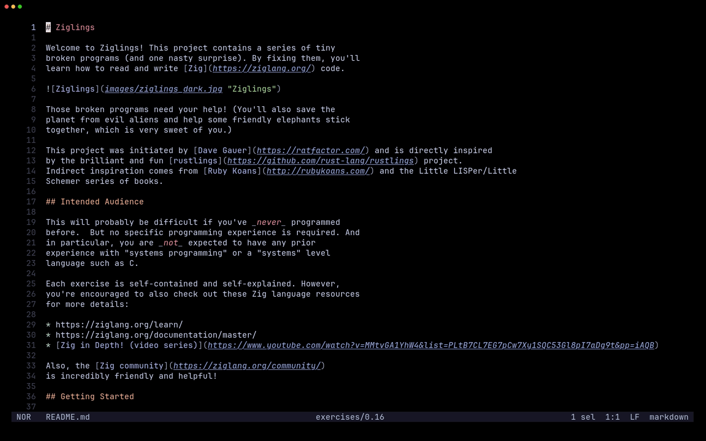

# trail.hx

trail.hx is a recent-projects picker for [Helix](https://github.com/helix-editor/helix/).

Jump to a recent project and browse its files side by side, without ever leaving the picker.



---

## Installation

**1. Install the plugin-enabled fork of Helix** by following the instructions [here](https://github.com/mattwparas/helix/blob/steel-event-system/STEEL.md).

**2. Install trail.hx via forge:**

```sh
forge pkg install --git https://github.com/Ra77a3l3-jar/trail.hx.git
```

Or clone this repo directly into your Steel cogs directory (usually `~/.steel/cogs/`).

**3. Load the plugin** by adding this to your `init.scm`:

```scheme
(require "trail/trail.scm")
```

---

## Usage

| Command / Key | Action |
|---|---|
| `Tab` | Switch focus between panes |
| `j`/`k` or `↑`/`↓` | Move the cursor |
| `Enter` | Projects pane: `cd` into the project and focus the files pane. Files pane: open the file |
| `Ctrl-x` | Remove the highlighted project from the list |

Bind `:trail-open` to a key, e.g. in `init.scm`:

```scheme
(keymap (global)
  (normal
    (space
      (p ":trail-open"))))
```

Recent projects are tracked automatically by Helix's workspace root each time it starts, and the files pane is scoped to whatever project you select.
